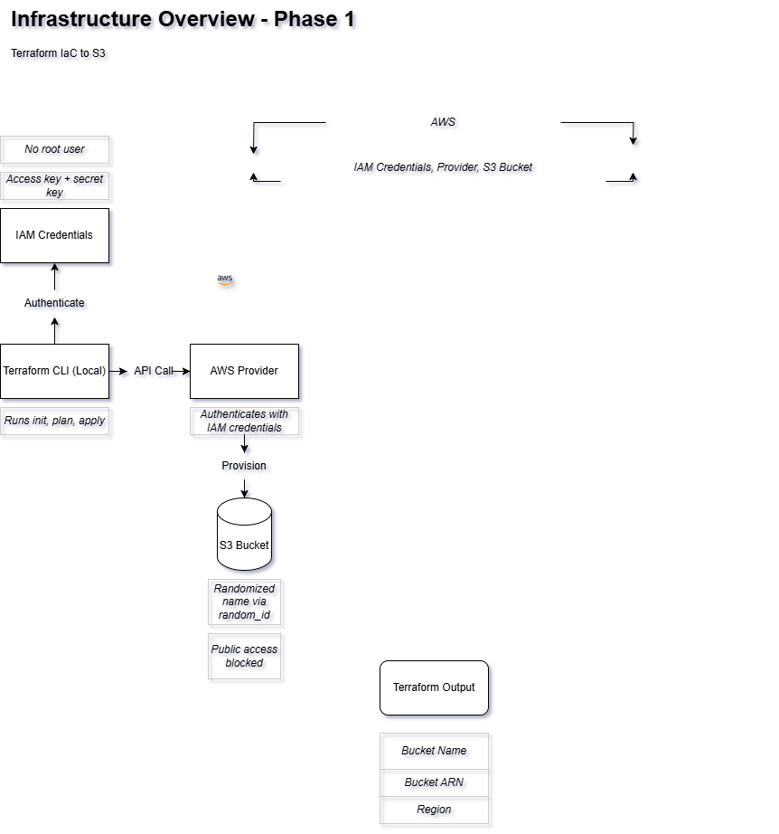

# JobIntel: A Cloud-Native DevOps Job Tracker

JobIntel is a fully cloud-native, cert-mapped job application tracker that uses Terraform, AWS, GitHub Actions, and Slack automation to track applications like a production system. [See full breakdown.](PROJECT_OVERVIEW.md)

## JobIntel-DevOps-Driven Job Tracker Platform

**Cloud-Native, DevOps-Powered Job Application Tracker**
_A fully automated, infrastructure-as-code system that helps manage job searches like a real production pipeline._

---

## Badges

---

## Live Automation

**Slack Alerts Triggered by GitHub Actions:**

> Successful & Failed Terraform Alerts now trigger Slack messages in real time.

---

## **Overview**

JobIntel is a cloud-native project I built while studying for certifications and job hunting remotely. I wanted something more powerful than a spreadsheet or Notion board — I wanted infrastructure, automation, and insights.

This project deploys a job application tracker with:
    - Full Terraform infrastructure
    - Slack integration for logging job events
    - CI/CD pipelines
    - OpenAI intelligence layer for analyzing feedback and rejection patterns
    - Resume version tracking + recruiter-facing S3 resume site

This project is being built in **phases**, with each mapped directly to DevOps certifications, real-world tooling, and production design.

- Phases 1–2 complete
- Phase 3: Observability, structured tfplan parsing, Slack log enrichment
- Phase 4+: Python backend, resume versioning, CLI, NLP intelligence

---

## Design Principles

This project is structured like a real internal platform tool:

- **Secrets managed via GitHub Environments**
- **CI/CD gated by environment filtering**
- **Terraform artifacts and logs uploaded as GitHub Actions artifacts**
- **Slack alerts scoped to production only**
- **Each phase is versioned and cert-aligned**

---

## Architecture Diagrams

This section provides versioned diagrams of the infrastructure and automation powering JobIntel.
Each diagram evolved with the project, showcasing best practices, real-world patterns, and cloud-native growth over time.

---

### Infra Overview (Terraform to AWS S3)

Terraform provisioning to AWS S3 using secure IAM access.

- **Terraform-Provisioned Infrastructure** — declarative IaC to deploy a randomized, public-blocked S3 bucket via `random_id`, ownership control, and secure authentication.

- **Phase 1 Scope** - Terraform CLI → AWS Provider → IAM Auth → S3 Provisioning (no root user, secure bucket)

---

### CI/CD Pipelines (GitHub Actions | CI/CD Systems)

Pipeline enforcing Terraform quality standards and enabling automation.

- **CI/CD Pipeline via GitHub Actions** — validates Terraform format, runs `terraform validate`, and auto-deploys IaC.

### Phase 2: CI/CD Pipeline with Slack & Artifacts

Terraform CI/CD pipeline powered by GitHub Actions and Slack. Built for security, clarity, and real-world DevOps readiness.

### Key Features

- Format, validate, and plan with each push
- JSON plan artifact creation
- Comment tfplan on PRs and pushes
- Slack notifications for success/failure
- Environment-based alert filtering (production only)
- Full workflow logs stored as artifacts

### Diagrams

| Version | Description |
|---------|-------------|
| v1      | Basic CI pipeline: fmt, validate, plan |
| v2      | Advanced: tfplan output, Slack, logs, environment logic |

---

### Observability Flow (Fail → Detect → Recover)

Mapping system errors, logs, and fallback response flow for production-grade observability.

- **Observability & Failure Flow** — “What breaks and what happens next?” diagram for real-time logging, alerting, and recovery pipelines.

- **Layered Strategy**: Track job rejections, Slack alerts, and feeds analytics to ML/NLP layer

---

## Cert Mapped Layers

| Layer                    | Tools/Tech                            | Mapped Certification(s)                 | Status  |
|--------------------------|----------------------------------------|------------------------------------------|---------|
| Infrastructure as Code   | Terraform, AWS (S3, Lambda, IAM)       | Terraform Associate, AWS SA Pro          |  Phase 1 Complete |
| Backend API              | Python (FastAPI, Flask), Boto3         | Python Certification                     |  Planned |
| Automation & Bot Logic   | Slack SDK, Python Scheduler, GH Actions| DevOps Core, Python                      |  Planned |
| Containerization         | Docker, Kubernetes                     | Docker DCA, CKA                          |  Planned |
| CI/CD Pipelines          | GitHub Actions                         | DevOps Mastery, CI/CD Systems            |  Phase 2 Complete |
| Monitoring & Logging     | CloudWatch, IAM Policy, Alerting       | AWS SA Pro, Cloud Security (Future)      |  Planned |
| Intelligence Layer       | OpenAI API, NLP, Resume Scoring        | ML/AI Exploratory                        |  Experimental |

---

## Real-World Impact

| What This Project Simulates | Real-World Job Skill |
|-----------------------------|-----------------------|
| Slack alerting + artifact uploads | On-call observability & CI/CD monitoring |
| GitHub Actions gated by environment | Secure pipeline workflows (prod vs dev logic) |
| Terraform + AWS IAM + S3 | Infrastructure-as-Code provisioning in real orgs |
| Logs & tfplan artifacts | Debugging infrastructure failures |
| Future: API + resume tracker | Internal platform tooling or job systems |

---

## **Live Features**

- [ ] Slack `/logjob` command → logs job to database
- [ ] Auto-send weekly job hunt stats via email or Slack DM
- [ ] Resume hosting on S3 with version tracking
- [ ] Web dashboard (minimal UI or Streamlit)

---

## **Cert Tracking**

| Certification               | Status        | Date Completed   |
|-----------------------------|---------------|------------------|
| Terraform Associate         | [ ]  |  May 2025                |
| Docker Certified Associate  | [ ]  |                  |
| Kubernetes CKA              | [ ]   |                  |
| AWS Solutions Architect Pro | [ ]   |                  |
| Python Certification        | [ ]   |                  |
| Cloud Security (TBD)        | [ ]    |                  |

---

## **Why I Built This**

Because job hunting deserves DevOps, too.

I was studying, building, and applying all at the same time — and this project let me do all three in one place. It’s my resume, my tracker, and my case study in infrastructure-as-career.

---

## **Repos in JobIntel**

- [`jobintel-infra`](https://github.com/destiny-malone/jobintel-infra) → Terraform IaC
- [`jobintel-api`](https://github.com/destiny-malone/jobintel-api) → Python backend
- [`jobintel-bot`](https://github.com/destiny-malone/jobintel-bot) → Slack integration
- [`jobintel-ui`](https://github.com/destiny-malone/jobintel-ui) → Resume/metrics frontend
- [`jobintel-ml`](https://github.com/destiny-malone/jobintel-ml) → NLP/feedback analytics
- [`jobintel-cicd`](https://github.com/destiny-malone/jobintel-cicd) → GitHub Actions, Terraform CI, Backend auto-deploy workflows
- [`jobintel-cli`](https://github.com/destiny-malone/jobintel-cli) → Terminal-based app tracker
- [`jobintel-docs`](https://github.com/destiny-malone/jobintel-docs) → Project notes, cert writeups, LinkedIn content

---

## **License**

MIT — Feel free to fork, build, and remix.
